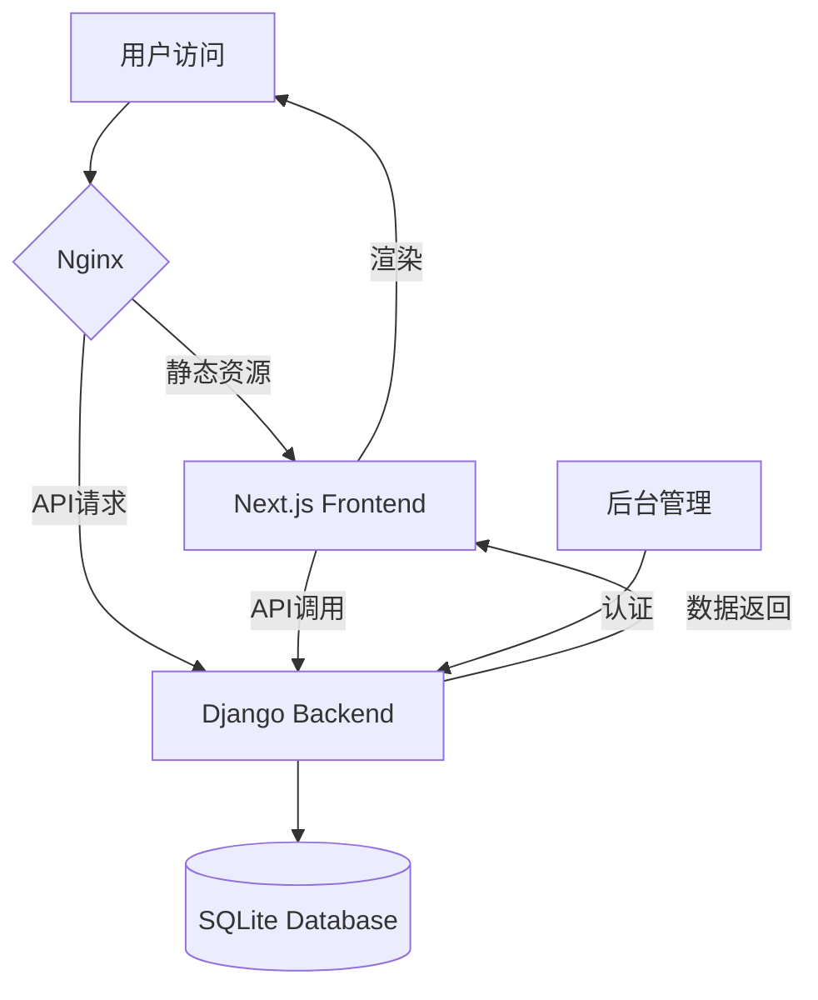

# 个人技术博客系统开发计划

## 技术栈

- **前端**: Next.js 14+ (React, App Router)
- **后端**: Django 4.2+ (REST Framework)
- **数据库**: SQLite (开发阶段)
- **部署**: Nginx
- **其他**: Prism.js (代码高亮), React Markdown (Markdown渲染)

## 项目结构

```
PersonalBlobDynamic/
├── frontend/              # Next.js 前端项目
│   ├── app/              # App Router 页面
│   ├── components/       # React 组件
│   ├── lib/             # 工具函数
│   └── public/          # 静态资源
├── backend/              # Django 后端项目
│   ├── blog/            # 主应用
│   ├── accounts/        # 用户认证
│   ├── api/             # API 视图
│   └── config/          # 配置
├── nginx/                # Nginx 配置
└── docker/              # Docker 配置（可选）
```

## 核心功能实现

### 阶段一：基础架构搭建

1. **初始化项目**

   - 创建Django项目结构（使用Django REST Framework）
   - 创建Next.js项目（使用App Router）
   - 配置CORS、环境变量、数据库连接

2. **用户认证系统**

   - Django用户模型扩展（区分管理员/普通用户）
   - JWT或Session认证
   - Next.js登录/注册页面
   - 权限中间件（RBAC）

3. **数据库模型设计**

   - 文章模型（Post）：标题、内容、分类、标签、作者、状态、发布时间、置顶、付费等
   - 分类模型（Category）
   - 标签模型（Tag）
   - 评论模型（Comment）：支持嵌套回复
   - 阅读量记录（ViewLog）：IP去重
   - 点赞记录（Like）
   - 付费记录（Payment）
   - 静态页面模型（StaticPage）

### 阶段二：核心内容功能

4. **文章管理API**

   - 文章CRUD接口（Django REST Framework）
   - Markdown内容处理
   - 分类/标签关联
   - 草稿/发布状态
   - 定时发布
   - 置顶功能

5. **前端文章展示**

   - 文章列表页（首页、分类页）
   - 文章详情页（支持Markdown渲染）
   - 代码高亮（Prism.js集成）
   - 文章目录（TOC）自动生成
   - 阅读量展示
   - 分页功能

6. **后台管理系统（前端）**

   - 使用Next.js构建 `/admin` 路由
   - 仪表板（数据统计）
   - 文章管理界面（CRUD）
   - 分类/标签管理
   - 评论审核界面
   - 用户管理

### 阶段三：交互功能

7. **评论系统**

   - 评论提交API（支持嵌套回复）
   - 评论列表API（支持审核状态）
   - 前端评论组件（树形结构展示）
   - 敏感词过滤（后端处理）
   - 防刷机制（限流）
   - XSS防护（内容转义）

8. **点赞功能**

   - 点赞API（IP/用户去重）
   - 前端点赞按钮
   - 防刷机制

9. **阅读量统计**

   - 阅读量记录API（IP去重，24小时去重）
   - 前端阅读量展示
   - 后台统计图表

### 阶段四：高级功能

10. **付费阅读**

    - 付费文章标记
    - 支付记录模型
    - 文章访问权限验证（API中间件）
    - 前端付费提示界面
    - 支付集成（微信/支付宝沙箱，或第三方服务）

11. **搜索功能**

    - 全文搜索API（Django ORM或Elasticsearch）
    - 前端搜索页面
    - 关键词高亮

12. **分类与标签**

    - 分类/标签API
    - 分类页面（分页）
    - 标签云展示

### 阶段五：静态页面与SEO

13. **静态页面**

    - 关于我页面（/about）
    - 友链页面（/friends）
    - 项目展示页面（/projects）
    - 简历页面（/resume）
    - 打赏页面（集成微信/支付宝二维码）

14. **SEO优化**

    - Next.js Metadata API配置
    - 动态生成meta标签（title, description）
    - Open Graph标签
    - Twitter Card
    - JSON-LD结构化数据
    - sitemap.xml生成

### 阶段六：UI/UX优化

15. **界面美化**

    - 响应式设计（Tailwind CSS）
    - 深色/浅色主题切换
    - 加载状态优化
    - 动画效果
    - 性能优化（代码分割、图片优化）

16. **Nginx部署配置**

    - Nginx配置文件（反向代理、静态资源）
    - Gzip压缩
    - 缓存策略
    - 安全头配置（CSP、X-Frame-Options）

## 关键技术实现点

### Django后端

- 使用Django REST Framework构建RESTful API
- Django Admin作为后台管理基础（或自定义管理界面）
- 使用Django中间件实现权限控制、阅读量统计
- 使用Django信号（Signals）处理关联操作
- 使用Django缓存（Redis可选）优化性能

### Next.js前端

- 使用App Router（Next.js 14+）
- 服务端渲染（SSR）和静态生成（SSG）结合
- API路由代理到Django后端
- 使用React Markdown渲染文章内容
- 使用Prism.js实现代码高亮
- 使用next-seo或内置Metadata API实现SEO

## 数据流示意



## 开发优先级

1. **P0（核心功能）**: 用户认证、文章CRUD、基础展示、后台管理
2. **P1（重要功能）**: 评论、点赞、阅读量、分类标签
3. **P2（增强功能）**: 付费阅读、搜索、SEO优化
4. **P3（优化功能）**: 静态页面、UI美化、性能优化

## 注意事项

- 所有用户输入必须进行验证和转义（防止XSS、SQL注入）
- API接口需要限流保护
- 敏感操作（如删除）需要权限验证
- 数据库查询需要优化（使用select_related、prefetch_related）
- 考虑使用Redis缓存热点数据
- 环境变量管理（.env文件）
- 提供完整的README文档说明开发、构建、部署流程